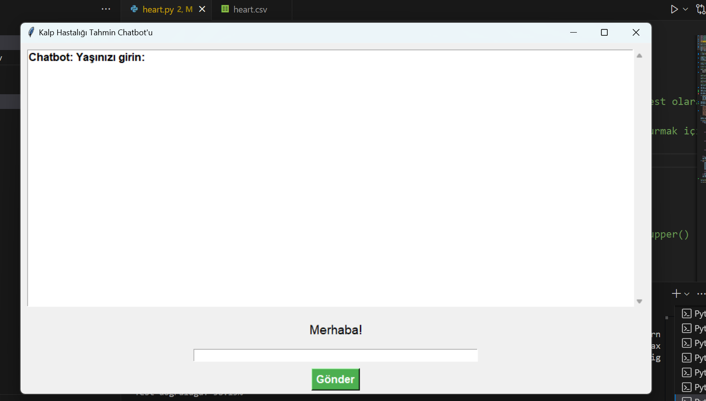
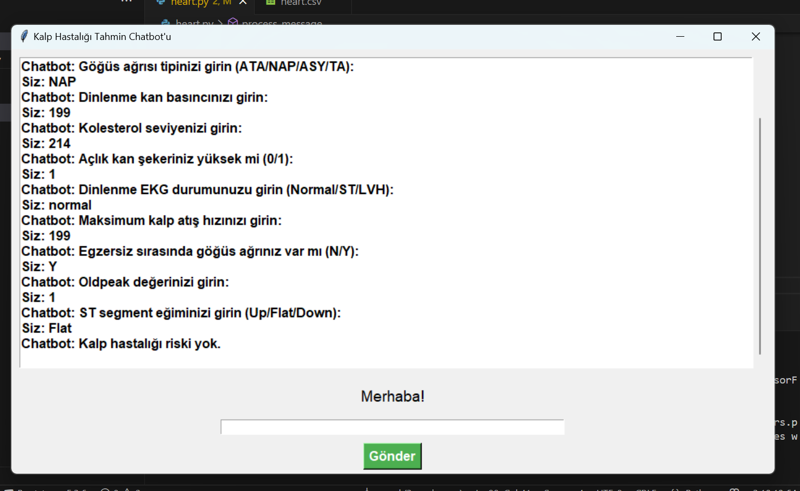

# 🫀 Kalp Hastalığı Tahmin Chatbot'u

Bu proje, **makine öğrenimi** kullanarak kullanıcıdan alınan bilgilerle **kalp hastalığı riski tahmini** yapan etkileşimli bir **chatbot arayüzü** sunar. Python ile geliştirilmiş, **Tkinter** GUI, **Pandas**, **Scikit-learn**, ve **TensorFlow** kütüphanelerinden faydalanılmıştır.

## 📸 Ekran Görüntüleri

### Ana Arayüz


### Soru-Cevap Sistemi


## ⚙️ Kullanılan Teknolojiler

- `Tkinter`: Arayüz oluşturmak için  
- `Pandas`: Veri işleme  
- `Scikit-learn`: OneHotEncoding, veri ölçekleme, veri bölme  
- `TensorFlow / Keras`: Yapay sinir ağı modeli  
- `heart.csv`: Kalp hastalığı veri seti  

## 📊 Model Özellikleri

- **Giriş verileri**: Yaş, cinsiyet, göğüs ağrısı tipi, kolesterol, EKG durumu vb. toplam 11 soru
- **Ön işleme**: One-Hot Encoding, StandardScaler
- **Model**:  
  - Girdi katmanı  
  - 2 gizli katman (`relu` aktivasyonu)  
  - Çıkış katmanı (`sigmoid`)  
- **Kayıp fonksiyonu**: Binary Crossentropy  
- **Optimizer**: Adam

## 💬 Chatbot Kullanımı

1. Uygulama çalıştırılır.
2. Chatbot, kullanıcıya sırayla 11 adet sağlık verisi sorar.
3. Kullanıcı yanıt verir.
4. Tüm veriler alındığında, eğitimli model kalp hastalığı riski olup olmadığını tahmin eder.

## ▶️ Çalıştırmak İçin

```bash
pip install pandas scikit-learn tensorflow
python app.py
